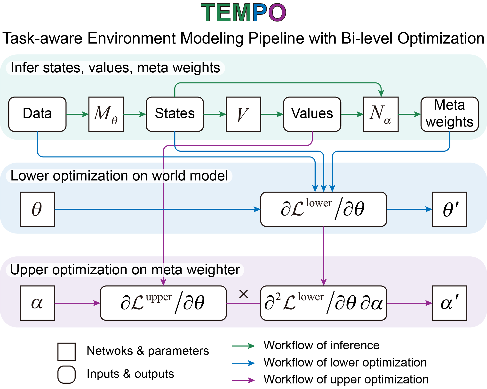
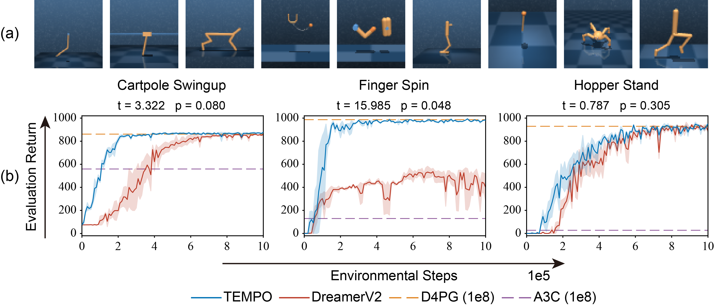
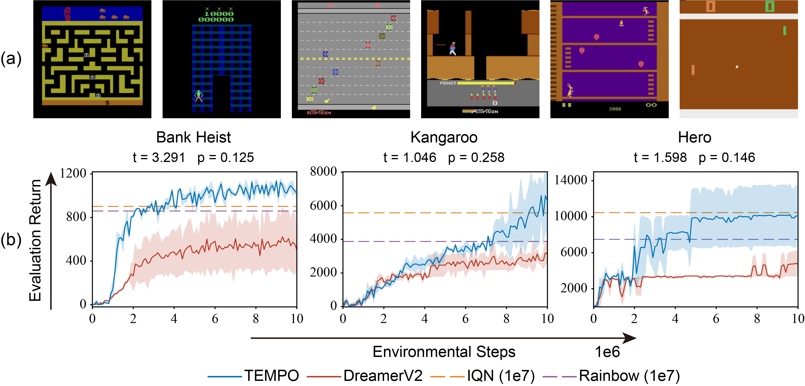

# <p align="center">Task-aware world model learning <br>with meta weighting via bi-level optimization <br>(NeurIPS 2023)</p>
This is a implementation of Task-aware Environment Modeling Pipline with Bi-level Optimization (TEMPO) 
built on top of the official [DreamerV2][website] code. This code work in a similar fashion to [DreamerV2][website]. 
Our main modifications are concentrated in `agent.py` and `common/nets.py`.

<p align='center'>
 

[website]: https://danijar.com/dreamerv2

If you find this code useful, please reference our paper in your work:

```
@inproceedings{
anonymous2023taskaware,
title={Task-aware world model learning with meta weighting via bi-level optimization},
author={Anonymous},
booktitle={Thirty-seventh Conference on Neural Information Processing Systems},
year={2023},
url={https://openreview.net/forum?id=IN3hQx1BrC}
}
```
## Dependencies
A conda environment configuration of our experiments is provided in 
[`env_config.yml`](https://github.com/HuiningYuan/TEMPO/blob/main/env_configs.yml).

Core dependencies can be installed using `pip`:

```sh
tensorflow==2.6.0
tensorflow-probability==0.14.0
ruamel-yaml==0.17.21
gym==0.19.0
atari-py==0.2.9
dm-control==1.0.11
```

## Instructions
Default hyperparameters for our experiments are provided in 
[`config.yaml`](https://github.com/HuiningYuan/TEMPO/blob/main/configs.yaml). By default, the code 
evaluates agent's performance with one episode every 1e5 training steps for Atari and 1e4 training steps 
for DMC.

Train on Atari:

```sh
python3 train.py --logdir ./logs/atari_pong --configs atari --task atari_pong
```

Train on DM Control:

```sh
python3 train.py --logdir ./logs/dmc_walker_walk --configs dmc_vision --task dmc_walker_walk
```

Monitor results:

```sh
tensorboard --logdir ./logs/atari_pong --samples_per_plugin "images=1000"
```

## Results
Results on DMC:

<p align='center'>
 
  
Results on Atari:

<p align='center'>
 
